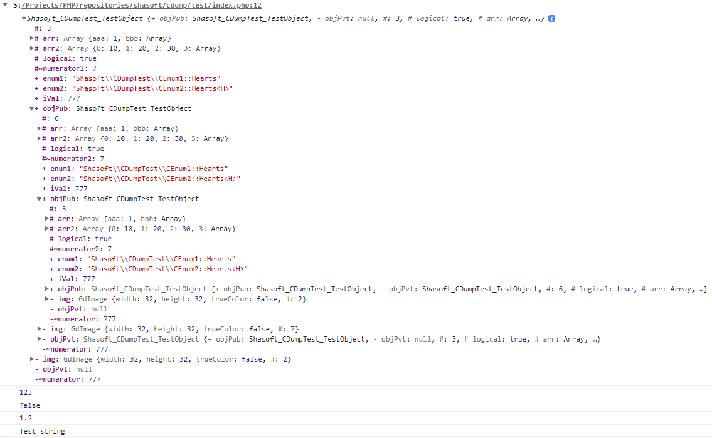
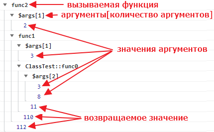

# Библиотека для вывода данных в console браузера.

## Вывод в консоль контрольных значений

**Код PHP**
```php
enum CEnum1
{
    case Hearts;
    case Diamonds;
    case Clubs;
    case Spades;
}
enum CEnum2: string
{
    case Hearts = 'H';
    case Diamonds = 'D';
    case Clubs = 'C';
    case Spades = 'S';
}
class TestObject0
{
    private static int $numerator = 777;
    public int $iVal = 777;
    public CEnum1 $enum1;
}
class TestObject extends TestObject0
{
    protected static int $numerator2 = 7;
    public ?TestObject $objPub;
    private ?TestObject $objPvt;
    protected bool $logical;
    protected array $arr = [];
    protected array $arr2 = [];
    private $img;
    public CEnum2 $enum2;
    // Конструктор
    public function __construct(?TestObject $obj)
    {
        $this->objPub = $obj;
        $this->objPvt = $obj;
        $this->logical = true;
        $this->arr['aaa'] = 1;
        $this->arr['bbb'] = [2, false, $obj];
        $this->arr2[] = 10;
        $this->arr2[] = 20;
        $this->arr2[] = 30;
        $this->arr2[] = $this->arr;
        $this->img = imagecreate(32, 32);
        $this->enum1 = CEnum1::Hearts;
        $this->enum2 = CEnum2::Hearts;
    }
}
// Создать объект
$obj1 = new TestObject(null);
$obj2 = new TestObject($obj1);
$obj1->objPub = $obj2;
// Вывести в консоль браузера
cdump($obj1, 123, false, 1.2, "Test string");
```

**Вывод в консоли браузера**



Позволяет раскрывать рекурсивные объекты до бесконечности.

## Логирование

**Код PHP**
```php
// Включить логирование
CDumpLog::enable(true);

class ClassTest
{
    static public function func0(int $x, int $delta): int
    {
        return CDumpLog::group(true, function () use ($x, $delta) {
            return $x + $delta;
        });
    }
}
// Логирование вызовов
function func1(int $a)
{
    return CDumpLog::group(true, function () use ($a) {
        return ClassTest::func0($a, 8) * 10;
    });
}
function func2(int $b): int
{
    return CDumpLog::group(true, function () use ($b) {
        return func1($b + 1) + 2;
    });
}

// Запустить функцию
func2(2);
```

**Вывод в консоли браузера**

